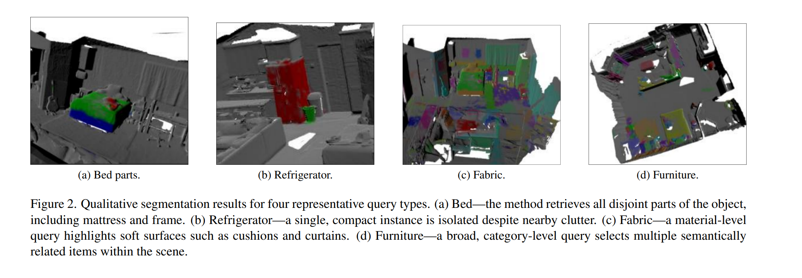

# ADL4CV_TUM_ovis
Combine OmniSeg3D and LSeg (or 2D object detection model) to perform Open Vocabulary Instance Segmentation in a 3D scene. This project was made as a part of [ADL4CV class](https://niessner.github.io/ADL4CV/) at TUM.

# TODOS
- [ ] Update code structure
- [ ] Add more examples
- [ ] Re-run evaluations

# Method
You can read a more in depth explanation of the method in the [final report](./assets/final_report.pdf).

# Examples

| Class        | LSeg     | Ours(LSeg) | GDINO    | Ours(GDINO) |
|--------------|----------|------------|----------|-------------|
| bed          | **0.805400** | 0.685096   | 0.150349 | 0.223188    |
| refrigerator | **0.740700** | 0.648852   | 0.172766 | 0.235231    |
| coffee table | 0.214200 | 0.300615   | 0.131786 | **0.585103** |
| curtains     | **0.668400** | 0.568797   | 0.179124 | 0.408395    |
| couch        | **0.744300** | 0.496864   | 0.221643 | 0.246086    |
| floor        | **0.721600** | 0.455712   | 0.227481 | 0.100537    |
| tv           | 0.320500 | **0.438510** | 0.189654 | 0.407430    |
| backpack     | 0.343400 | 0.388006   | 0.206748 | **0.437556** |
| **ceiling**  | **0.456412** | 0.388316   | 0.149557 | 0.067867    |
| **couch**    | **0.413625** | 0.204179   | 0.260813 | 0.349405    |
| doors        | 0.365846 | 0.475618   | 0.295334 | **0.511147** |
| fireplace    | 0.158921 | **0.417614** | 0.049485 | 0.026661    |

*Table: Per-class Intersection-over-Union (IoU) on ScanNet scene0. The table compares two image-level baselines (LSeg and Grounding DINO) with the same models combined with the proposed 3D clustering (“Ours”). Scores are computed in the original camera views; only a representative subset of classes is shown. Boldface marks the highest IoU for each class.*
